# Caravan Automation

Shelly scripts for our caravan, plus tooling to push them to the devices.

## Contents

- `src/shelly/toiletLight.js` — toilet light controller with PIR-driven night lighting, manual brightness controls, and a PIR enable/disable toggle.
- `scripts/put_script.py` — official Shelly upload tool ([source](https://github.com/ALLTERCO/shelly-script-examples/blob/main/tools/put_script.py)). Stops the target script, uploads the new code in 1 KB chunks, then restarts it.
- `scripts/deploy.js` — named deploy wrapper so each Shelly script can have a stable `npm run` command.
- `tests/` — Node-based test harness that loads each Shelly script into a sandboxed VM with stubs for the `Shelly` and `Timer` globals, so the event-handling logic can be exercised without a device.
- `eslint.config.js` — ESLint + `eslint-plugin-sonarjs` setup with stricter complexity thresholds for `src/` and `scripts/`.

## Hardware

The toilet light system uses a **Shelly Plus RGBW PM** as the controller. Two of its four PWM channels drive lights, and the four physical inputs are wired to a PIR sensor, two buttons, and a light-level sensor.

```mermaid
flowchart LR
    subgraph Inputs
        PIR["input:0<br/>PIR Sensor"]
        PB["input:1<br/>Push Button"]
        TB["input:2<br/>Touch Button"]
        LDR["input:3<br/>Light Sensor (LDR)"]
    end

    subgraph Controller["Shelly Plus RGBW PM<br/>toiletLight.js"]
        SCRIPT[" "]
    end

    subgraph Outputs
        MAIN["light:0<br/>Main Lights"]
        IND["light:1<br/>PIR Indicator LED"]
    end

    PIR --> SCRIPT
    PB --> SCRIPT
    TB --> SCRIPT
    LDR --> SCRIPT
    SCRIPT --> MAIN
    SCRIPT --> IND
```



The push-button input on the Shelly must be configured in **button** mode (in the Shelly web UI) so it emits `single_push` and `long_push` events.

## Behaviour

| Input | Event | What it does |
|-------|-------|--------------|
| PIR (input:0) | `btn_down` | Turn the main light to **night brightness (25%)** for 5 min, but only when it's dark *and* PIR mode is enabled. |
| Push Button (input:1) | `single_push` | Toggle PIR mode on/off. The indicator LED reflects the current state (on = PIR enabled). |
| Push Button (input:1) | `long_push` | Turn the main light to **full (100%)**, overriding any PIR-driven state. Long-pressing again while already at full turns it off. |
| Touch Button (input:2) | `toggle` | Set **day brightness (75%)**. Toggling while already at 75% turns the light off. |
| Light Sensor (input:3) | (analog) | Gates the PIR — readings above the configured threshold (50%) mean "too bright, ignore motion". |

Brightness levels (`CONFIG.brightnessLevels` in the script):

| Level  | Value |
|--------|-------|
| night  | 25%   |
| day    | 75%   |
| full   | 100%  |

If motion is detected while PIR mode is *disabled*, the indicator LED briefly pulses on (300 ms) and then resyncs to its disabled state. This makes it easy to confirm the sensor is wired correctly without the main light coming on.

## Requirements

- A Shelly Gen2+ device (Plus / Pro / Gen3) reachable on the local network.
- `python3` — ships with macOS, no extra install needed.
- `node` 24+ — used for the local test runner.

## Development

```bash
npm test     # Run the local Node test harness
npm run lint # ESLint + sonarjs (cognitive complexity, max-depth, etc.)
```

The lint config is stricter for `src/` and `scripts/` (cognitive complexity 10, cyclomatic 8, max-depth 3, max function length 40 lines) and looser for tests.

## Deploying

```bash
npm run deploy -- <device-ip> <script-slot-id> "src/shelly/toiletLight.js"
```

Example:

```bash
npm run deploy -- 192.168.1.50 1 "src/shelly/toiletLight.js"
```

If you prefer, you can still call `./scripts/put_script.py` directly with the same arguments.

For named deploys, use:

```bash
npm run deploy:toilet-light -- <device-ip>
```

Example:

```bash
npm run deploy:toilet-light -- 192.168.1.50
```

This looks up the script on the device by name and deploys to the script whose name matches the target file, for example `toiletLight.js`.
The deploy wrapper logs the lookup and the resolved slot before upload starts.

To override the slot explicitly:

```bash
npm run deploy:toilet-light -- 192.168.1.50 2
```

If you add more Shelly scripts later, wire them into `scripts/deploy.js` and they can get their own `npm run deploy:<name>` command.

- `<device-ip>` — IP or hostname of the Shelly device.
- `<script-slot-id>` — the numeric slot on the device. Find it in the Shelly web UI under **Scripts**, or list them with:
  ```bash
  curl http://<device-ip>/rpc/Script.List
  ```
  Named deploys use this list automatically to find the script with the expected name. If no script with that name exists yet, the deploy wrapper falls back to the lowest unused slot ID and `put_script.py` creates the script there during upload — no manual setup required.

The script name on the device is set to the uploaded filename.
